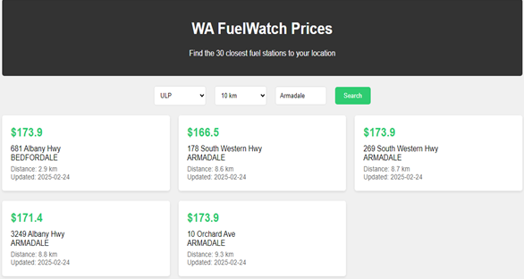

# The Fuel Search Web App  

## Overview

The Fuel Search Web App is designed to help users find fuel stations within a specified distance of a given location. The app allows users to select their preferred fuel type, enter a location, and define a search radius to retrieve relevant results.

## Features

Fuel Type Selection: Users can choose from a dropdown list of available fuel types (e.g., Unleaded, Diesel, Premium, LPG, etc.).

Location Input: Users can manually enter their location to set the search starting point.

Distance Selection: A distance filter allows users to define the search radius (e.g., 5 km, 10 km, 20 km) to refine results.

Interactive Map Integration: Results can be displayed on an interactive map for better visualization.

Real-Time Data Fetching: The app fetches real-time fuel price data and station availability where applicable.

Sorting & Filtering Options: Users can sort stations by price, distance, or availability.

## How It Works

Select Fuel Type: Use the dropdown menu to choose the preferred fuel type.

Enter Location: Type in a city, suburb, or specific address as the search reference.

Set Distance Range: Select the maximum search radius to filter results.

Search & View Results: Click the search button to retrieve fuel stations matching the criteria.

View Details & Navigate: Click on a fuel station to see detailed pricing and location information, with an option to navigate using a preferred map application.

## Requirements

- Frontend: HTML, CSS, JavaScript (React or Vue recommended)

- Backend: Python (Flask or Django) / Node.js for API handling

- Database: Firebase, PostgreSQL, or MongoDB (for storing locations and fuel prices)

- APIs Used: Google Maps API, Fuel Price APIs (such as FuelWatch)

## Future Enhancements

- User Accounts: Option for users to save favorite fuel stations and receive price alerts.

- Mobile App Integration: Develop an Android/iOS version for better accessibility.

- Advanced Filters: Additional filters for fuel quality, station amenities, and brand preferences.

## Installation & Setup

Clone the repository:

git clone [https://github.com/ShebMichel/DevHub-Colab/FuelPriceProject/fuel-search-webapp.git](https://github.com/ShebMichel/DevHub-Colab.git)

Navigate to the project directory:

- cd FuelPriceProject 
- run python main.py # Backend
- copy the hyperlink (something like this:  *http://localhost:3000*) on your terminal
- paste the link to the browser.

## Contribution

Contributions are welcome! Feel free to submit pull requests or report issues in the repository.

## License

This project is licensed under the MIT License. See the LICENSE file for details.

