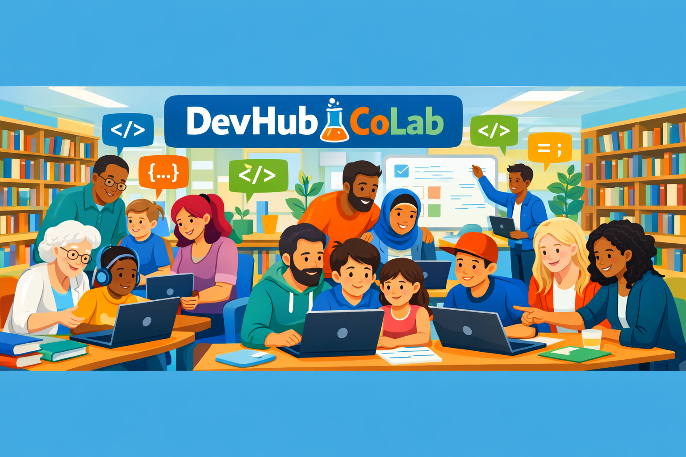

<div align="center">

# 🚀 DevHub CoLab

### *Where Code Meets Community*



**A Social Coding Club at Armadale Public Library**

[](./LICENSE)
[]()
[]()

[Join Us](#-get-involved) • [Projects](#-our-projects) • [Donate](#-support-us)

</div>

---

## 💡 Our Story

DevHub CoLab is more than just a coding club—it's a **movement to democratize tech & education**. Born in the heart of Armadale Public Library, we bring together learners of all ages and backgrounds to explore, create, and grow together through code.

From kids taking their first steps with Python to developers building full-stack applications, we believe that **everyone deserves access to quality tech education**.

---

## 🌟 Our Projects

### 🎓 Learning Paths

<table>
<tr>
<td width="50%">

**🧒 KidsZone**
- Turtle graphics & animations
- Digital dice rollers
- Interactive games
- Perfect for ages 8-14

</td>
<td width="50%">

**🎮 FunGame**
- Snake, Hangman, Tic-Tac-Toe
- Memory card challenges
- Math quiz games
- Beginner-friendly projects

</td>
</tr>
<tr>
<td width="50%">

**🧮 Calculator & Excel**
- Build calculators from scratch
- Excel automation with Python
- Data manipulation skills
- Real-world applications

</td>
<td width="50%">

**📊 Data & Web**
- Database integration
- Flask web applications
- API development
- Full-stack fundamentals

</td>
</tr>
</table>

### 🚀 Community Applications

| Project | Description | Tech Stack |
|---------|-------------|------------|
| **Perth Sustainability App** | Track and promote sustainable practices | React, TypeScript, Node.js, Prisma |
| **Community Event Finder** | Discover local events and activities | Flask, Python |
| **Fuel Price Tracker** | Real-time fuel price monitoring | Python, Web Scraping |
| **SMB Automation** | Business automation tools | Flask, SQLite |

---

## 🎯 What We Offer

```
✨ Free coding workshops and mentorship
🤝 Peer-to-peer learning environment
💻 Hands-on project experience
🌍 Real-world application development
📚 Access to learning resources
🏆 Portfolio-building opportunities
```

---

## 🙌 Get Involved

### For Learners
1. **Visit us** at Armadale Public Library
2. **Explore** our projects on GitHub
3. **Fork** a project that interests you
4. **Learn** by doing and asking questions

### For Contributors
```bash
# Clone the repository
git clone https://github.com/ShebMichel/DevHub-Colab.git

# Pick a project
cd DevHub-Colab/[project-name]

# Start contributing!
```

We welcome:
- 📝 Documentation improvements
- 🐛 Bug fixes
- ✨ New features
- 🎨 UI/UX enhancements
- 🌐 Translations

---

## 💖 Support Us

Your support helps us:
- 📧 michel@dmnsolutions.com.au
- 🖥️ Provide equipment for learners
- 📚 Develop new curriculum
- 🎉 Host community events
- 🌱 Grow our programs

**Every contribution makes a difference!**

<div align="center">

### [💝 Donate to DevHub CoLab](#)

*Help us keep tech education free and accessible for everyone*

</div>

---

## 📜 License

This project is licensed under the MIT License - see the [LICENSE](./LICENSE) file for details.

---

## 👨‍💼 Reference

**Michel M. Nzikou**  
*Founder & Program Lead, DMN SOLUTIONS* 


---

<div align="center">

### 🌟 Together, We Code. Together, We Grow. 🌟

**Supported by the City of Armadale**

Made with ❤️ by the DevHub CoLab Community

</div>
